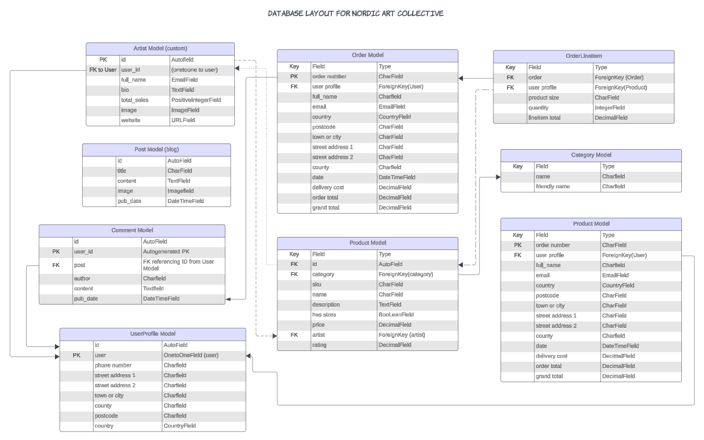
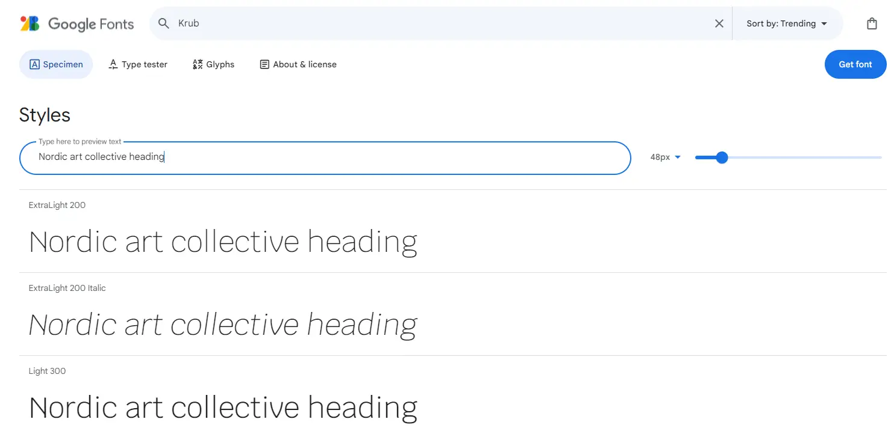
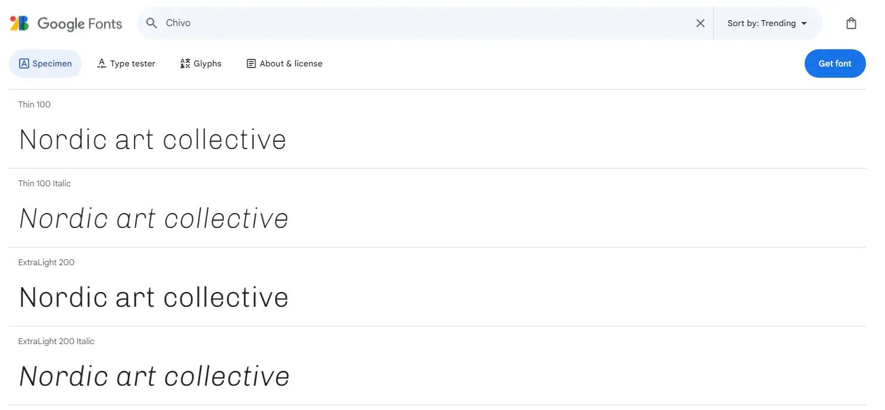
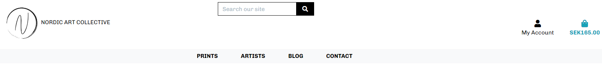
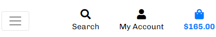
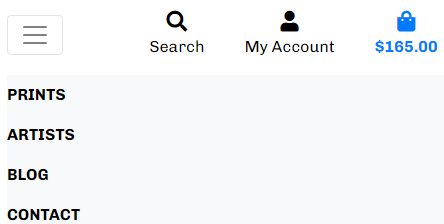
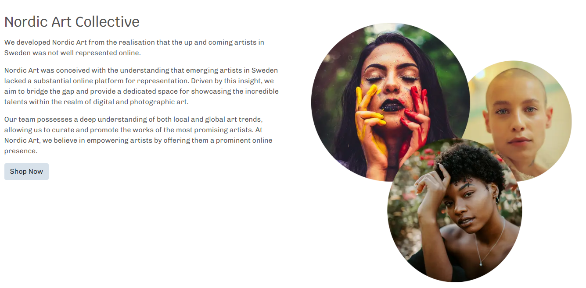
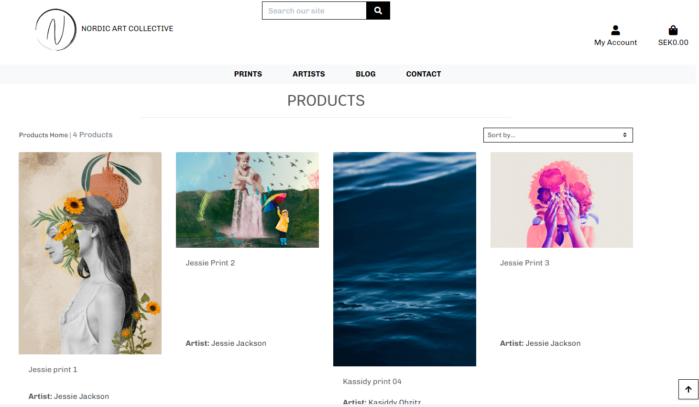
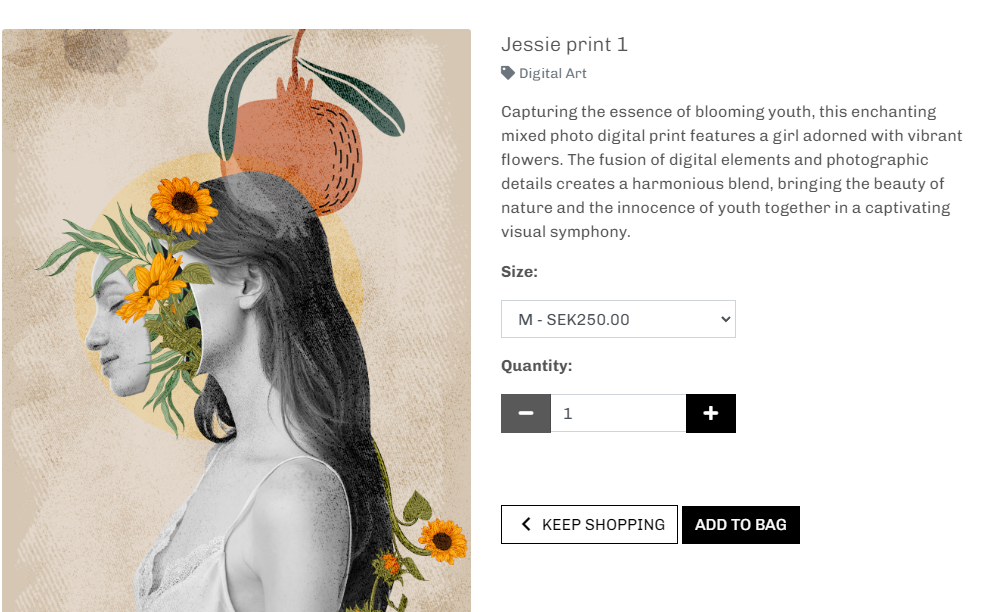
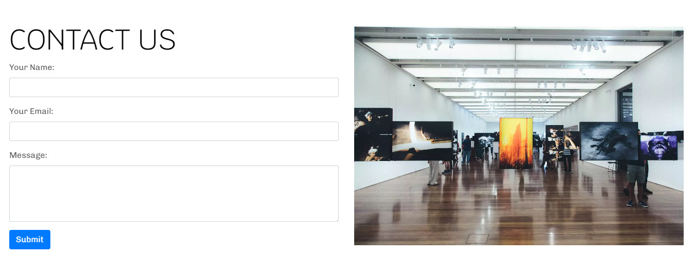

# Nordic Art Collective-PP5

[Live site on heroku](https://nordic-art-22f58cb8c917.herokuapp.com/)

[Github repository](https://github.com/adrianskelton/adrianproject5)

# Table Of Content

-   [User Experience](#user-experience)
    -   [User Stories](#user-stories)
    -   [Site Goals](#site-goals)
    -   [Scope](#scope)
-   [Design](#design)
    -   [Colour Scheme](#colour-scheme)
    -   [Database Schema](#Database-Schema)
    -   [Fonts](#Fonts)
    -   [Wireframes](#Wireframes)
    -   [Agile Methodology](#Agile-Methodology)
         -   [Overview](#overview)
         -   [EPICS(Milestones)](#epicsmilestones)
         -   [User Stories issues](#user-stories-issues)
         -   [MoSCoW prioritization](#moscow-prioritization)
         -   [GitHub Projects](#github-projects)
-   [Features](#features)
    -   [Navbar](#Navbar)
    -   [Footer](#Footer)
    -   [Home](#Home)
        -   [Hero Section](#hero-section)
        -   [Search Form](#search-form)
        -   [Product Card](#product-card)
    -   [Profile Page](#profile-page)
    -   [Sign In Page](#sign-in-page)
    -   [Sign Up Page](#sign-up-page)
    -   [Sign Out Confirmation](#sign-out-confirmation)
    -   [Password reset](#password-reset)
    -   [Password reset email sent](#password-reset-email-sent)
    -   [Enter a new password](#enter-a-new-password)
    -   [Password Reset Completed](#password-reset-completed)
    -   [Error Pages](#error-pages)
-   [Future Features](#future-features)
-   [Marketing](#marketing)
-   [Search Engine Optimization SEO](#search-engine-optimization-seo)
-   [Testing](#testing)
-   [Bugs](#Bugs)
-   [Technologies And Languages](#technologies-and-languages)
    -   [Languages Used](#languages-used)
    -   [Python Modules](#python-modules)
    -   [Technologies and programs](#technologies-and-programs)
-   [Deployment](#deployment)
    -   [Before Deployment](#before-deployment)
    -   [Deployment on Heroku](#deployment-on-heroku)
    -   [Creating A Fork](#creating-a-fork)
    -   [Cloning Repository](#cloning-repository)
-   [Credits](#credits)
    -   [Media](#media)
    -   [Code](#code)
    -   [Acknowledgements](#acknowledgements)
    -   [Comments](#comments)

## User Experience

### User Stories
1. As a user

### Site Goals
1. To provide users with a place to purchase art prints from different artists in Sweden.
2. To provide the users the ability to search artists and style of art.
3. To provide the users with the ability to save art to their wishlist
4. To provide the users with the ability to check their order history.
6. To provide the users with the ability to leave a feedback for the artists.

### Scope

Key Features:

Benefits:

## Design
### Colour Scheme
The colour scheme is of the website is quite toned down as not to take away from the prints so that they are the main focus and the user experience of the website is ease of functionality in focus without color distractions in the navigation. I did this also in mind that most Scandinavian homes have subdued interior home colours and the website then mimics this.

    1. Background color usage - #d7e1ea
    2. Background color (same as boothstrap bg-lite) - #f8f9fa 

### Database Schema

1. User:
lorum ipsum lorum ipsum lorum ipsum lorum ipsum lorum ipsum lorum ipsum 

2. UserProfile:
lorum ipsum lorum ipsum lorum ipsum lorum ipsum lorum ipsum lorum ipsum 

3. Category
lorum ipsum lorum ipsum lorum ipsum lorum ipsum lorum ipsum lorum ipsum 

### Fonts
I chose 2 fonts that look clean and minimalistic from google fonts.

#### Chivo #### - used for 

Krub - Used for the headings of  

### Wireframes

Included below are the wireframes I made for the most detailed pages, the account functionality pages I skipped over as they didnt require much layout planning. 

- Home

Home

- Product

Product list
 

- Product

Product detail
 

### Agile Methodology
#### Overview
lorum ipsum lorum ipsum lorum ipsum lorum ipsum lorum ipsum lorum ipsum 

#### Epics(Milestones)
lorum ipsum lorum ipsum lorum ipsum lorum ipsum lorum ipsum lorum ipsum 

#### User Stories Issues
lorum ipsum lorum ipsum lorum ipsum lorum ipsum lorum ipsum lorum ipsum 

#### MoSCoW prioritization
lorum ipsum lorum ipsum lorum ipsum lorum ipsum lorum ipsum lorum ipsum 

#### GitHub Projects
lorum ipsum lorum ipsum lorum ipsum lorum ipsum lorum ipsum lorum ipsum 

## Features
#### Navbar
The navigation bar remains a constant feature on every page, crafted with Bootstrap and fine-tuned for complete responsiveness. The left segment is dedicated to content navigation, while the right side pertains to user authentication. Authenticated users have additional options, whereas unauthenticated users are prompted to log in or register.

On the mobile version of the navbar, all content is revealed upon clicking a hamburger icon. Upon activation, a dropdown display appears, presenting all navigation links.

**Desktop header**

**Mobile header Closed**  

**Mobile header Expanded**

### Toasts
lorum ipsum lorum ipsum lorum ipsum lorum ipsum lorum ipsum lorum ipsum 

### Breadcrumbs
lorum ipsum lorum ipsum lorum ipsum lorum ipsum lorum ipsum lorum ipsum 

#### Footer
lorum ipsum lorum ipsum lorum ipsum lorum ipsum lorum ipsum lorum ipsum 

### Home Page
#### Hero Section
The hero section has a brief description of what web site is about and then has a shop now button which will take the user to the shop where all the prints will be displayed. There is also an image of the listed artists on the right hand side of the text.

#### Products
The products page

### Products Page
I made a way to update the prices of the products in a batch manner instead of doing the tedious changes one by one. I did this by using djangos basecommand feature. 
I then made simple script to do this. 

### Products Card
lorum ipsum lorum ipsum lorum ipsum lorum ipsum lorum ipsum lorum ipsum lorum ipsum lorum ipsum lorum ipsum lorum ipsum lorum ipsum lorum ipsum 

### Single Products Page
The single product page shows the main image, product writeup, category and the price/sizing options. You can then select the number of prints you want and clicking add to bag or click keep shopping to choose something else.

### Size options page (TODO)
This is accessed by the size guide floating button.

### Contact Us Page
The contact page is a simple contact form with your name, email and message box. An image of a photography exhibition is to the right. 

### Artists Page (custom model)
lorum ipsum lorum ipsum lorum ipsum lorum ipsum lorum ipsum lorum ipsum 

### Author Page
lorum ipsum lorum ipsum lorum ipsum lorum ipsum lorum ipsum lorum ipsum 

### My Profile Page
lorum ipsum lorum ipsum lorum ipsum lorum ipsum lorum ipsum lorum ipsum 

#### Profile
lorum ipsum lorum ipsum lorum ipsum lorum ipsum lorum ipsum lorum ipsum 

#### Order History
lorum ipsum lorum ipsum lorum ipsum lorum ipsum lorum ipsum lorum ipsum 

#### My Wishlist
lorum ipsum lorum ipsum lorum ipsum lorum ipsum lorum ipsum lorum ipsum 

### Admin
lorum ipsum lorum ipsum lorum ipsum lorum ipsum lorum ipsum lorum ipsum 
#### Dashboard
lorum ipsum lorum ipsum lorum ipsum lorum ipsum lorum ipsum lorum ipsum 

Admin dashboard:

Refine Products:

#### Add Products
lorum ipsum lorum ipsum lorum ipsum lorum ipsum lorum ipsum lorum ipsum 

#### Add author
lorum ipsum lorum ipsum lorum ipsum lorum ipsum lorum ipsum lorum ipsum 

#### Edit Product
lorum ipsum lorum ipsum lorum ipsum lorum ipsum lorum ipsum lorum ipsum 

#### Delete Product

#### Orders Admin
lorum ipsum lorum ipsum lorum ipsum lorum ipsum lorum ipsum lorum ipsum lorum ipsum lorum ipsum lorum ipsum lorum ipsum lorum ipsum lorum ipsum 

Admin Orders;

Orders Refine:

#### Edit Order Status
lorum ipsum lorum ipsum lorum ipsum lorum ipsum lorum ipsum lorum ipsum 

#### Admin Discount Codes
lorum ipsum lorum ipsum lorum ipsum lorum ipsum lorum ipsum lorum ipsum 

Admin Discounts

Admin Refine Codes

Admin Add Code

Admin Edit Code

Admin Delete Code

### Shopping Cart
lorum ipsum lorum ipsum lorum ipsum lorum ipsum lorum ipsum lorum ipsum 

##### Stock Quantity
lorum ipsum lorum ipsum lorum ipsum lorum ipsum lorum ipsum lorum ipsum 

### Checkout

### Order confirmation page

### Confirmation email

### User Authentication

## Future Features

A few of the features that would be applied in future. 
- Giftcards available to purchase and send to friends online, thereby growing the community and generating more sales.
- Add a mailing list when the number of users has increased more
- Youtube social media channel with regular content creation

## Search Engine Optimization SEO and Marketing

### Business Model

### SEO

The keywords I tried to focus on were "sweden photo prints", "swedish artists" and other non generic longer keywords as the internet is already flooded with art print sites, I wanted the keywords to zero in on the geographical location as this is where the marketing will be and it is part of the brand. 

The content in the blog section also uses the artists name and the keywords of prints and order to help push the seo quality up.

The alt image descriptions were also thought of with the artists name and name of the print. The meta keywords were filled with again geographic based keywords including sweden and nordic in the keywords as well as the artists names.

### Marketing

I made a facebook business page for my site as I felt that was the best way to engage with a large audience and build up a clientbase organically. As most artists are on facebook and have their own social media pages, the business facebook page could then link up to all of theirs and generate interest by the artists also promoting Nordic Art Collective and visa versa. Regular posts to the page such as new art, interviews with artists and other art related articles could be posted both on the site at a later stage in development and then shared on social media via the business page. 

Below is a video showing the page with a few articles posted, all of these posts could be boosted to gain a greater audience depending on the companies marketing budget.

video src="static/edia/readme/facebook-page.mp4">

## Testing
Testing documentation can be found [here.](TESTING.md)
## Bugs
|Bug|Status|
| ---| ---|
|[BUG: report #35](https://github.com/adrianskelton)|Closed|
### bug non-nullable
While making changes to the models in my post and comment app I kept getting errors. 
You are trying to add a non-nullable field 'image' to post without a default; we can't do that (the database needs something to populate existing rows).
Please select a fix:
 1) Provide a one-off default now (will be set on all existing rows with a null value for this column)
 2) Quit, and let me add a default in models.py
Select an option: 
### Fix: 
The above still did not work so I had to rollback to a previous migration before the errors. I found this information on [Stackoverflow](https://stackoverflow.com/questions/32123477/how-to-revert-the-last-migration)

### bug no white space
I was posting all the blog posts from the admin and for some reason it was stripping 

[White space article](https://developer.mozilla.org/en-US/docs/Web/CSS/white-space)

***Bug:***
While trying to create custom 404 and 500 pages I kept just getting a simple error "A server error occurred. Please contact the administrator." instead of the custom pages I had made. 

***Fix:*** 
Reading up I saw I could not use extends from tags in custom 404 and 500 pages [Stackoverflow](https://stackoverflow.com/questions/75071972/i-have-problem-with-cutomizing-the-404-page-in-django)

## Technologies And Languages

### Languages Used
- HTML
- CSS
- JavaScript
- jQuery
- Bootstrap
- Python
- Django

### Python Modules

### Technologies and programs
 - [Favicon Generator](https://favicon.io/favicon-converter/) was used to generate Favicon

## Deployment
### Before Deployment

### Stripe setup

### AWS setup

### Deployment on Heroku

### Creating a fork

### Cloning Repository

### Migrating database content

Because I had a lot of products and data in sqllite already that did not migrate to elephantSQL I used this tutorial to move the data (https://hevodata.com/learn/sqlite-to-postgresql/#Method_1_SQLite_to_PostgreSQL_using_Django)

error... 
django.db.utils.IntegrityError: Problem installing fixture '/workspace/adrianproject5/whole.json': Could not load profiles.UserProfile(pk=1): duplicate key value violates unique constraint "profiles_userprofile_user_id_key"
DETAIL:  Key (user_id)=(2) already exists.
fix...
gitpod /workspace/adrianproject5 (main) $ python manage.py loaddata --exclude auth.permission --exclude contenttypes --exclude profiles whole.json
Installed 100 object(s) (of 203) from 1 fixture(s)
gitpod /workspace/adrianproject5 (main) $ 

## Credits
### Media
- [Research for color combinations](https://www.color-hex.com/color-palette/11590)
- [Digital artwork from freepik.com](https://www.freepik.com/free-photos-vectors/digital-art)
- [Favicon generator](https://favicon.io/favicon-converter/)

### Code

[CSS idea for custom horizontal rule](https://jsfiddle.net/yLKNh/186/)

### Acknowledgements

[Color pallette idea](https://www.color-hex.com/color-palette/11590)
[Tutorial on custom 404](https://www.youtube.com/watch?v=oX_XKlPJAQk&ab_channel=ThinkThank)
### Comments

