Go back to [README.md](/README.md)

# Testing

- [Code Validation](#code-validation)
  - [HTML](#html)
  - [CSS](#css)
  - [JavaScript](#JavaScript)
  - [Python](#python)
- [Responsiveness](#Responsiveness)
- [Browser Compatibility](#browser-compatibility)
- [Lighthouse](#Lighthouse)
- [CRUD](#crud)
- [Manual Testing](#manual-testing)
- [Automated Testing](#automated-testing)
- [User Story Testing](#user-story-testing)
- [Stripe](#stripe)
- [Bugs](#bugs)

## Code Validation

### HTML

| Page               | Validator                                                                            | Result            | Comment                                         |
| ------------------ | ------------------------------------------------------------------------------------ | ----------------- | ----------------------------------------------- |
| Home               |                         | <mark>PASS<mark>  |                                                 |
| Products           |                     | <mark>PASS<mark>  |                                                 |
| Product Detail     |          | <mark>PASS<mark>  |                                                 |
| Add Product        |                | <mark>PASS<mark>  |                                                 |
| Edit Product       |               |                                             |

### CSS

| File     | Validator                                                       | Result           |
| -------- | --------------------------------------------------------------- | ---------------- |
| Base     | 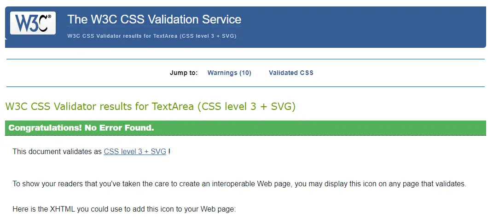         | <mark>PASS<mark> |
| Home  | 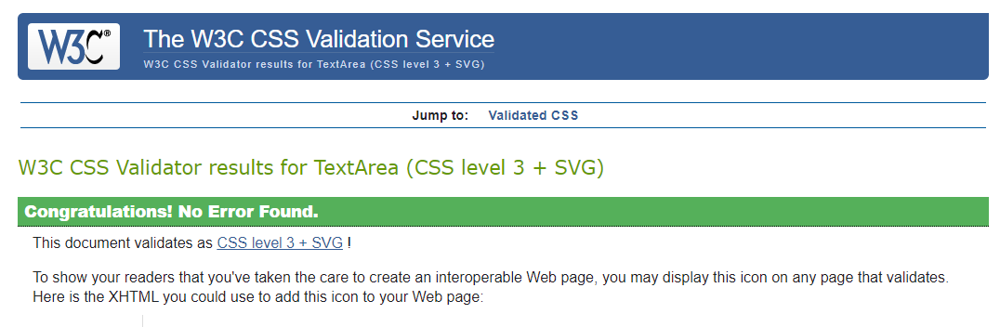  | <mark>PASS<mark> |
| Profile  |   | <mark>PASS<mark> |
| Checkout | 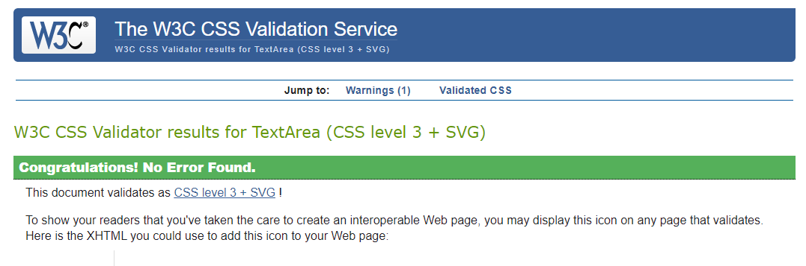 | <mark>PASS<mark> |

## JavaScript

| File               | Validator                                                                   | Result           | Comment                          |
| ------------------ | --------------------------------------------------------------------------- | ---------------- | -------------------------------- |
| stripe_elements.js | 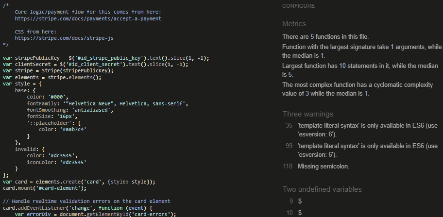 | <mark>PASS<mark> | Global variables and es6 enabled |
| countryfield.js           | 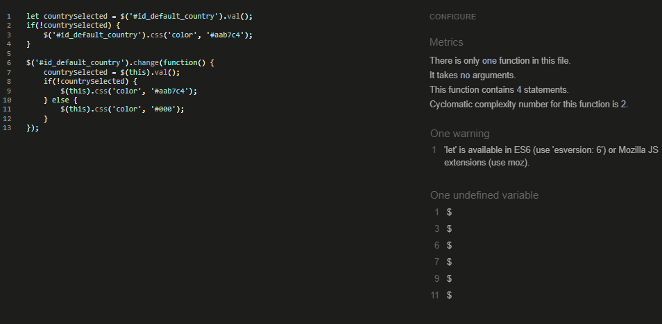                    | <mark>PASS<mark> | 'let' is available in ES6 (use 'esversion: 6') or Mozilla JS extensions (use moz). |

## Python

| File     | App      | Image                                                                     | Result           | Comment                                                             |
| -------- | -------- | ------------------------------------------------------------------------- | ---------------- | ------------------------------------------------------------------- |
| views    | home     | 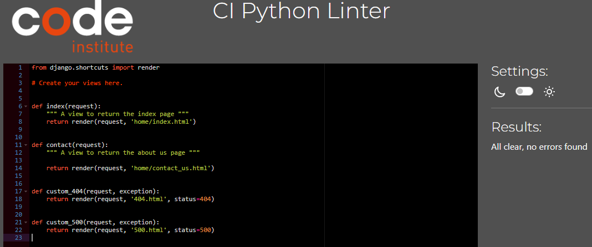           | <mark>PASS<mark> |                                                                     |
| urls     | home     | 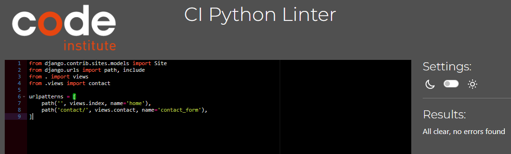             | <mark>PASS<mark> |                                                                     |<mark>PASS<mark> |                                                                     |
| views    | products | 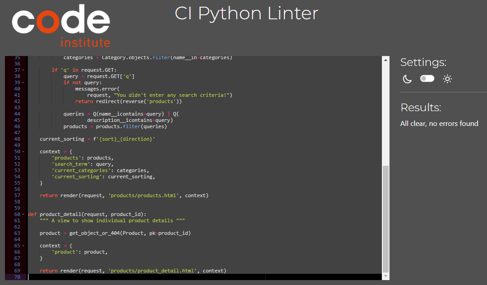       | <mark>PASS<mark> |                                                                     |
| urls     | products | 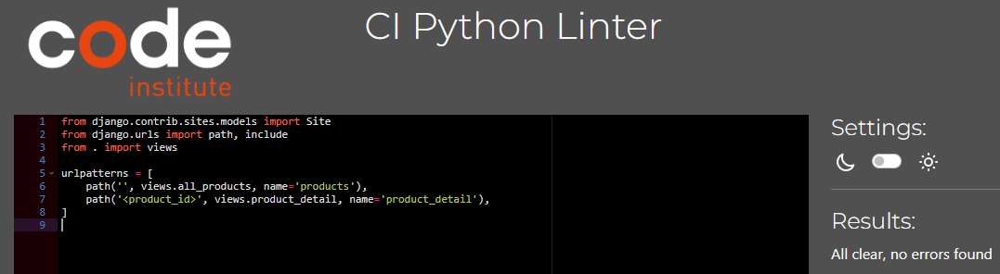         | <mark>PASS<mark> |                                                                     |
| models   | products | 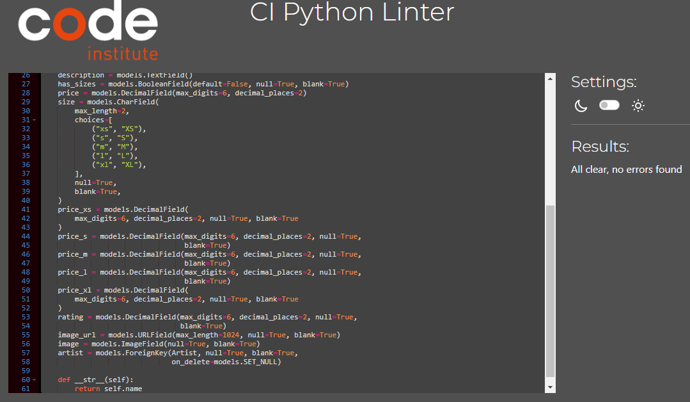     | <mark>PASS<mark> |                                                                     |
| admin    | products | 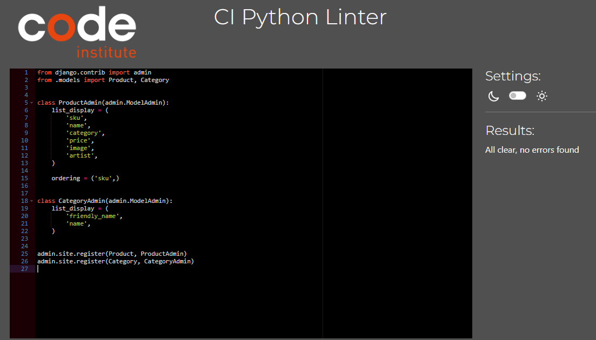       | <mark>PASS<mark> |                                                                     |
| forms    | products | 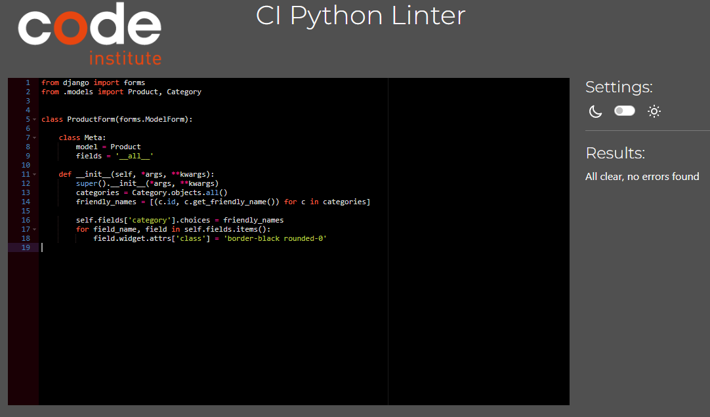        | <mark>PASS<mark> |                                                                     |                                                                    |
| views    | profiles | 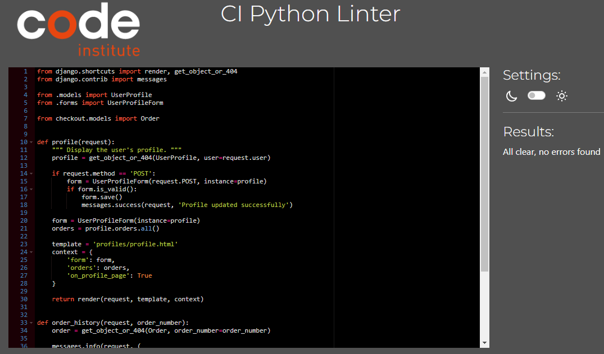       | <mark>PASS<mark> |                                                                     |
| urls     | profiles | 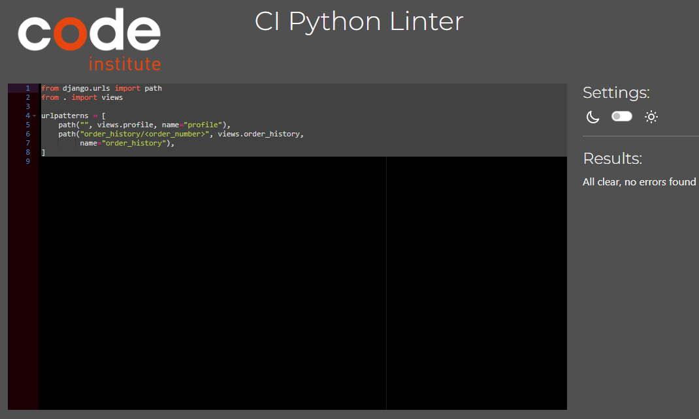         | <mark>PASS<mark> |                                                                     |
| models   | profiles | 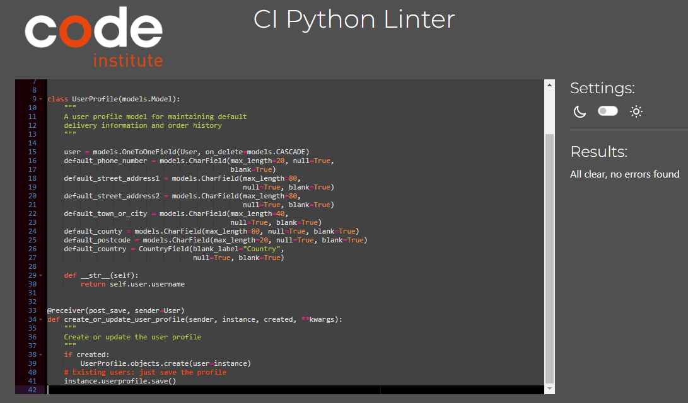     | <mark>PASS<mark> |                                                                     |
| webhooks | checkout | 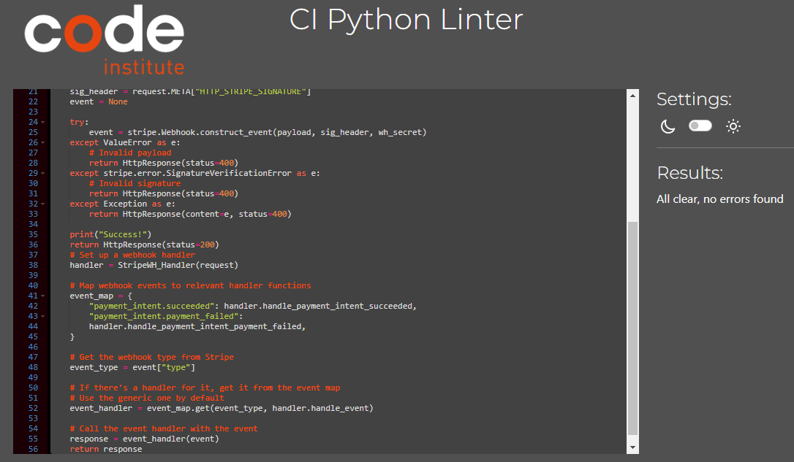 | <mark>PASS<mark> |  |
| handler  | checkout |    | <mark>PASS<mark> |                                                                     |
| view     | checkout |         | <mark>PASS<mark> |                                                                     |
| urls     | checkout |          | <mark>PASS<mark> |                                                                     |
| tests    | checkout |         | <mark>PASS<mark> |                                                                     |
| signals  | checkout |    | <mark>PASS<mark> |                                                                     |
| models   | checkout |      | <mark>PASS<mark> |                                                                     |
| forms    | checkout |        | <mark>PASS<mark> |                                                                     |
| admin    | checkout |        | <mark>PASS<mark> |                                                                     |
| views    | cart     |            | <mark>PASS<mark> |                                                                     |
| utils    | cart     |            | <mark>PASS<mark> |                                                                     |
| urls     | cart     |              | <mark>PASS<mark> |                                                                     |
| tests    | cart     |            | <mark>PASS<mark> |                                                                     |
| context  | cart     |        | <mark>PASS<mark> |                                                                     |

## Responsiveness

The responsiveness of the website was thoroughly tested on various devices, including a Huawei matebook 15-inch, and a 24-inch monitor. Across all devices, the elements displayed cleanly and were well-organized, ensuring a consistent and user-friendly experience. I also tested it on my google pixel 7a and on google chrome's responsiveness checker with inspector tools.

## Browser Compatibility

| Browser       | Result                                                     | Pass/Fail         |
| ------------- | ---------------------------------------------------------- | ----------------- |
| Google Chrome | All pages, load as expected. All features work as expected | <mark>Pass</mark> |
| Firefox       | All pages, load as expected. All features work as expected | <mark>Pass</mark> |
| Edge          | All pages, load as expected. All features work as expected | <mark>Pass</mark> |
| Safari        | All pages, load as expected. All features work as expected | <mark>Pass</mark> |

## Lighthouse

| Page                   | Validator                                                                                    | Result                 |
| ---------------------- | -------------------------------------------------------------------------------------------- | ---------------------- |
| Home                   | 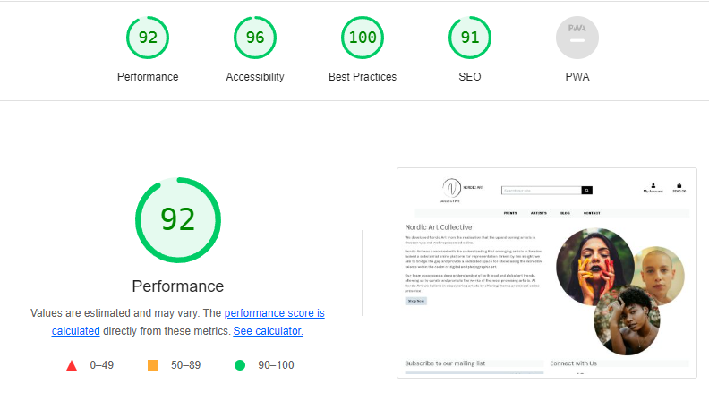                                  | <mark>Excellent</mark> |
| Home Mobile            | 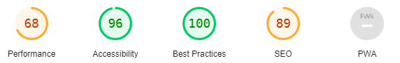                     | <mark>Good</mark>      |
| Products               | 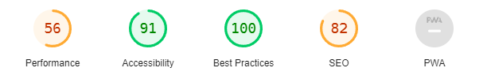                          | <mark>Good</mark> |
| Product Mobile         | 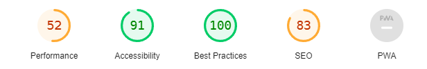             | <mark>Pass</mark>      |
| Product Detail         | 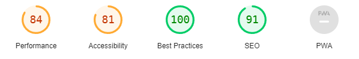               | <mark>Good</mark>      |
| Product Detail Mobile  | 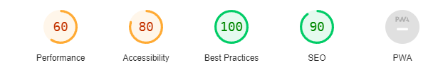  | <mark>Pass</mark>      |
| Artists Mobile    | 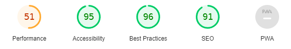     | <mark>Pass</mark>      |
| Artists     | 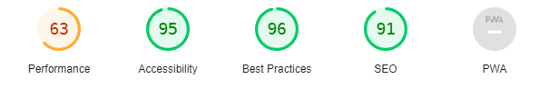     | <mark>Pass</mark>      |
| Artists Mobile    | 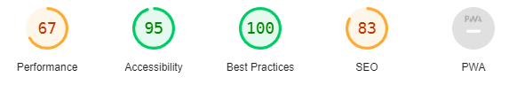    | <mark>Pass</mark>      |
| Blog            | 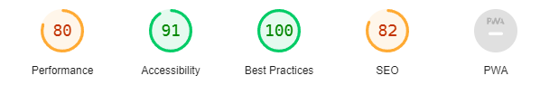                       | <mark>Excellent</mark> |
| Blog Mobile      |           | <mark>Good</mark> |
| Contact us      | 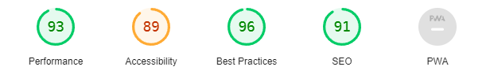          | <mark>Excellent</mark> |
| Contact us Mobile     | 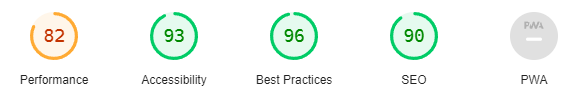          | <mark>Excellent</mark> |

Signficant optimisation practices were used to try and increase the Largest Contentful Paint (LCP)

1. Lazy load of images where possible
2. Defer load non essential JS scripts
3. Use of online image convertor to webp images

I could further reduce the size of images possibly and also minify the scripts but due to time constraints this will need to be done later.

## CRUD

The main custom crud functionality of this website pertains to the comments by the users who are allowed to submit, edit and delete comments. However users can also view products and orders as well as create a user profile for themselves and edit order information such as delivery address.

## Manual Testing

### Site Navigation

| Element                  | Action      | Expected Result                                         | Pass/Fail         |
| ------------------------ | ----------- | ------------------------------------------------------- | ----------------- |
| Logo                     | Click       | Redirect to Home page                                   | <mark>Pass</mark> |
| My Account Button        | Click       | Render a dropdown menu of all account options           | <mark>Pass</mark> |
| Prints Link              | Click       | Dropdown expands showing photography and digital subcategories              | <mark>Pass</mark> |
| Photography Link         | Click       | Redirect to selected photography prints category page   | <mark>Pass</mark> |
| Digital Link             | Click       | Redirect to selected digital prints category page       | <mark>Pass</mark> |
| Artists Link             | Click       | Redirect to selected artists page                       | <mark>Pass</mark> |
| Profile Dropdown         | Click       | Redirect to selected page                               | <mark>Pass</mark> |
| Profile Dropdown Link    | Click       | Redirect to selected page                               | <mark>Pass</mark> |
| Profile Dropdown Auth    | Display     | Render logout, profile, courses, add product links      | <mark>Pass</mark> |
| Profile Dropdown NonAuth | Click       | Render login and register links                         | <mark>Pass</mark> |
| Cart Icon Link           | Click       | Redirect to cart page                                   | <mark>Pass</mark> |
| Hamburger Menu           | Click       | Render a dropdown menu of all links                     | <mark>Pass</mark> |
| Contact Page             | Click       | Redirect to contact page                                | <mark>Pass</mark> |
| Newsletter Input Valid   | Submit      | User notified of success                                | <mark>Pass</mark> |
| Newsletter Input Invalid | Submit      | Error context displayed to UI                           | <mark>Pass</mark> |
| Register Link            | Display     | Render for non authenticated users                      | <mark>Pass</mark> |
| Log in Link              | Display     | Render for non authenticated users                      | <mark>Pass</mark> |
| Log out Link             | Display     | Render only if user is authenticated                    | <mark>Pass</mark> |
| Profile Link             | Display     | Render only if user is authenticated                    | <mark>Pass</mark> |
| Nav Link                 | Hover/Focus | Darken colour of text                                   | <mark>Pass</mark> |
| Footer Socials           | Click       | Opens the related github or facebook page in new tab    | <mark>Pass</mark> |

### Home Page

| Element            | Action | Expected Result                           | Pass/Fail         |
| ------------------ | ------ | ----------------------------------------- | ----------------- |
| Shop Now Button    | Click  | Redirect to selected product page         | <mark>Pass</mark> |

### Product Page

| Element                  | Action      | Expected Result                                                 | Pass/Fail         |
| ------------------------ | ----------- | --------------------------------------------------------------- | ----------------- |
| Category Widgets         | Click       | Redirect to selected product category page                      | <mark>Pass</mark> |
| Filter By Price Button   | Click       | Filter queried products based on price                          | <mark>Pass</mark> |
| Filter By Rating Button  | Click       | Filter queried products based on rating                         | <mark>Pass</mark> |
| Filter By Sale Button    | Click       | Filter queried products based on sale                           | <mark>Pass</mark> |
| Filter Direction         | Display     | Filter direction displayed via an arrow                         | <mark>Pass</mark> |
| Current Category         | Display     | Current displayed category is shown in the header               | <mark>Pass</mark> |
| Search Bar               | Search      | Filter products based on query to category, name or description | <mark>Pass</mark> |
| Product Cards            | Display     | All filtered Product Cards Rendered in grid layout              | <mark>Pass</mark> |
| Product View Card Button | Click       | Redirect to product detail page                                 | <mark>Pass</mark> |
| Product Edit Button      | Display     | Only moderators and admins can see this button                  | <mark>Pass</mark> |
| Product Edit Button      | Click       | Redirect to edit product page                                   | <mark>Pass</mark> |
| Product View Card Button | Hover/Focus | Background darkens, text lightens                               | <mark>Pass</mark> |
| Product Edit Button      | Hover/Focus | Background darkens                                              | <mark>Pass</mark> |
| Filter Button            | Hover/Focus | Background darkens                                              | <mark>Pass</mark> |
| Search Icon              | Hover/Focus | Background darkens                                              | <mark>Pass</mark> |
| Category Widgets         | Hover/Focus | Background turns orange, text turns white                       | <mark>Pass</mark> |

### Product Detail Page

| Element             | Action      | Expected Result                                                  | Pass/Fail         |
| ------------------- | ----------- | ---------------------------------------------------------------- | ----------------- |
| Quantity Input      | Input       | Updates the total amount of desired product - no negative values | <mark>Pass</mark> |
| Add to Cart Button  | Click       | Total quantity of item added to cart                             | <mark>Pass</mark> |
| Add to Cart Button  | Click       | Notification appears upon outcome of adding to cart              | <mark>Pass</mark> |
| Product Edit Button | Display     | Only moderators and admins can see this button                   | <mark>Pass</mark> |
| Product Edit Button | Click       | Redirect to edit product page                                    | <mark>Pass</mark> |
| Back Link           | Click       | Redirects back to the products page                              | <mark>Pass</mark> |
| Paginator           | Click       | All navigations buttons redirect to correct paginated results    | <mark>Pass</mark> |
| View Product Button | Click       | Redirect to related product detail page                          | <mark>Pass</mark> |
| Related Products    | Display     | Display product cards of 4 related items with pagination         | <mark>Pass</mark> |
| Back Link           | Hover/Focus | Text darkens                                                     | <mark>Pass</mark> |
| Add to Cart Button  | Hover/Focus | Background darkens, text lightens                                | <mark>Pass</mark> |
| Product Edit Button | Hover/Focus | Background darkens                                               | <mark>Pass</mark> |
| Paginator Button    | Hover/Focus | Background darkens                                               | <mark>Pass</mark> |

### Add Product Page

| Element            | Action      | Expected Result                                | Pass/Fail         |
| ------------------ | ----------- | ---------------------------------------------- | ----------------- |
| Authentication     | Display     | Only Moderators and Admins can access the page | <mark>Pass</mark> |
| Form               | Display     | A form is rendered with all fields editable    | <mark>Pass</mark> |
| Form               | Display     | Required fields are clearly marked             | <mark>Pass</mark> |
| Form Valid         | Submit      | A a product is saved to the database           | <mark>Pass</mark> |
| Form Valid         | Submit      | User is redirected to the products page        | <mark>Pass</mark> |
| Form Valid         | Submit      | A notification displays the success message    | <mark>Pass</mark> |
| Form Invalid       | Submit      | Error context is rendered to the UI            | <mark>Pass</mark> |
| Form Invalid       | Submit      | A notification display an error occured        | <mark>Pass</mark> |
| Form Invalid       | Submit      | User is redirected to the add product page     | <mark>Pass</mark> |
| Products Link      | Click       | Navigate to products page                      | <mark>Pass</mark> |
| Products Link      | Hover/Focus | Darkens text                                   | <mark>Pass</mark> |
| Form Image Button  | Hover/Focus | Darkens background                             | <mark>Pass</mark> |
| Form Submit Button | Hover/Focus | Darkens background                             | <mark>Pass</mark> |

### Edit Product Page

| Element             | Action      | Expected Result                                           | Pass/Fail         |
| ------------------- | ----------- | --------------------------------------------------------- | ----------------- |
| Tests Add Products  | All         | All validation and display context from add products pass | <mark>Pass</mark> |
| Form                | Display     | Product data is pre rendered to the page                  | <mark>Pass</mark> |
| Form                | Display     | Product data is pre rendered to the page                  | <mark>Pass</mark> |
| Current Image       | Display     | Link to current image displayed                           | <mark>Pass</mark> |
| Current Image Clear | Checked     | Image is removed from the product                         | <mark>Pass</mark> |
| Current Image Clear | Checked     | Image is removed from the product                         | <mark>Pass</mark> |
| Form Update Button  | Click       | Form is submitted                                         | <mark>Pass</mark> |
| Form Delete Button  | Click       | Confirmation modal appears                                | <mark>Pass</mark> |
| Modal Delete Button | Click       | Product is removed from the database                      | <mark>Pass</mark> |
| Modal Delete Button | Click       | User is redirected to the products page                   | <mark>Pass</mark> |
| Modal Delete Button | Click       | A notification message is displayed to user               | <mark>Pass</mark> |
| Modal Cancel Button | Click       | Modal is hidden                                           | <mark>Pass</mark> |
| Products Link       | Click       | Navigate to products page                                 | <mark>Pass</mark> |
| Products Link       | Hover/Focus | Darkens text                                              | <mark>Pass</mark> |
| Form Update Button  | Hover/Focus | Darkens background                                        | <mark>Pass</mark> |
| Form Delete Button  | Hover/Focus | Darkens background                                        | <mark>Pass</mark> |

### Program Page

| Element                 | Action      | Expected Result                                                 | Pass/Fail         |
| ----------------------- | ----------- | --------------------------------------------------------------- | ----------------- |
| Category Widgets        | Click       | Redirect to selected program category page                      | <mark>Pass</mark> |
| Filter By Price Button  | Click       | Filter queried programs based on price                          | <mark>Pass</mark> |
| Filter By Rating Button | Click       | Filter queried programs based on rating                         | <mark>Pass</mark> |
| Filter By Sale Button   | Click       | Filter queried programs based on sale                           | <mark>Pass</mark> |
| Filter Direction        | Display     | Filter direction displayed via an arrow                         | <mark>Pass</mark> |
| Current Category        | Display     | Current displayed category is shown in the header               | <mark>Pass</mark> |
| Search Bar              | Search      | Filter programs based on query to category, name or description | <mark>Pass</mark> |
| Program Cards           | Display     | All filtered program Cards Rendered in grid layout              | <mark>Pass</mark> |
| Program Card            | Click       | Redirect to program detail page                                 | <mark>Pass</mark> |
| Product Card            | Hover/Focus | Border outline turns blue, cursor is a pointer                  | <mark>Pass</mark> |
| Filter Button           | Hover/Focus | Background darkens                                              | <mark>Pass</mark> |
| Search Icon             | Hover/Focus | Background darkens                                              | <mark>Pass</mark> |
| Category Widgets        | Hover/Focus | Background turns orange, text turns white                       | <mark>Pass</mark> |

### Program Detail Page

| Element                  | Action      | Expected Result                                                | Pass/Fail         |
| ------------------------ | ----------- | -------------------------------------------------------------- | ----------------- |
| Enroll Button            | Click       | Adds course to cart                                            | <mark>Pass</mark> |
| Remove from Cart Button  | Click       | Removes course from cart                                       | <mark>Pass</mark> |
| Login to Enroll          | Click       | Redirects to login page                                        | <mark>Pass</mark> |
| Enrolled Button          | Click       | Button is disabled if already enrolled                         | <mark>Pass</mark> |
| Add / Remove Cart Button | Click       | Notification appears upon outcome of adding/removing from cart | <mark>Pass</mark> |
| Module Accordion         | Click       | Display hidden text and rotate arrow                           | <mark>Pass</mark> |
| Back Link                | Click       | Redirects back to the programs page                            | <mark>Pass</mark> |
| Paginator                | Click       | All navigations buttons redirect to correct paginated results  | <mark>Pass</mark> |
| View Product Button      | Click       | Redirect to related program detail page                        | <mark>Pass</mark> |
| Related Products         | Display     | Display program cards of 4 related items with pagination       | <mark>Pass</mark> |
| Video                    | Display     | Display Video if course is purchased in orders                 | <mark>Pass</mark> |
| Enrolled Button          | Display     | Display Enrolled grey button if course is purchased            | <mark>Pass</mark> |
| Back Link                | Hover/Focus | Text darkens                                                   | <mark>Pass</mark> |
| Add to Cart Button       | Hover/Focus | Background darkens, text lightens                              | <mark>Pass</mark> |
| Remove from Cart Button  | Hover/Focus | Background darkens, text lightens                              | <mark>Pass</mark> |
| Login to Enroll          | Hover/Focus | Background darkens, text lightens                              | <mark>Pass</mark> |
| Paginator Button         | Hover/Focus | Background darkens                                             | <mark>Pass</mark> |

### Subscription Page

| Element                     | Action      | Expected Result                                                | Pass/Fail         |
| --------------------------- | ----------- | -------------------------------------------------------------- | ----------------- |
| Subscribe Button            | Click       | Adds subscription to cart                                      | <mark>Pass</mark> |
| Subscribe Button            | Click       | If subscription is already in cart it is replaced              | <mark>Pass</mark> |
| Remove Subscription Button  | Click       | A confirmation modal is displayed                              | <mark>Pass</mark> |
| Remove Subscription Confirm | Click       | Current active subscription is removed                         | <mark>Pass</mark> |
| Add / Remove Cart Button    | Click       | Notification appears upon outcome of adding/removing from cart | <mark>Pass</mark> |
| Non authenticated users     | Visit       | Redirected to Login page                                       | <mark>Pass</mark> |
| Remove Subscription Button  | Display     | If already subscribed remove button rendered and card is grey  | <mark>Pass</mark> |
| Subscription status         | Display     | Current subscription noticed in subheading                     | <mark>Pass</mark> |
| Subscribe Button            | Hover/Focus | Text darkens, border darkens                                   | <mark>Pass</mark> |

### Cart Page

| Element                     | Action      | Expected Result                                                | Pass/Fail         |
| --------------------------- | ----------- | -------------------------------------------------------------- | ----------------- |
| Update Cart Button          | Click       | Updates the quantity of product by desired amount              | <mark>Pass</mark> |
| Remove from Cart Button     | Click       | Removes all quantity of selected item from cart                | <mark>Pass</mark> |
| Remove Subscription Button  | Click       | A confirmation modal is displayed                              | <mark>Pass</mark> |
| Remove Subscription Confirm | Click       | Current active subscription is removed                         | <mark>Pass</mark> |
| Add / Remove Cart Button    | Click       | Notification appears upon outcome of adding/removing from cart | <mark>Pass</mark> |
| Checkout Button             | Click       | Redirects to checkout page                                     | <mark>Pass</mark> |
| Continue Shopping Link      | Click       | Redirects to products page                                     | <mark>Pass</mark> |
| Update Cart Button          | Display     | Only available for products                                    | <mark>Pass</mark> |
| Discounts                   | Display     | All added discounts are displayed (sale, membership)           | <mark>Pass</mark> |
| Total Cost                  | Display     | Total cost is accurately displayed with breakdown              | <mark>Pass</mark> |
| Update Cart Button          | Hover/Focus | Background darkens, text darkens                               | <mark>Pass</mark> |
| Remove from cart Button     | Hover/Focus | Background darkens, text darkens                               | <mark>Pass</mark> |
| Checkout Button             | Hover/Focus | Background darkens                                             | <mark>Pass</mark> |
| Continue Shopping Link      | Hover/Focus | Text darkens                                                   | <mark>Pass</mark> |

### Checkout Page

| Element                    | Action      | Expected Result                                            | Pass/Fail         |
| -------------------------- | ----------- | ---------------------------------------------------------- | ----------------- |
| Checkout No Items          | Display     | Redirect to cart page with noti                            | <mark>Pass</mark> |
| Checkout Form              | Submit      | Checkout form submit user and delivery data to stripe      | <mark>Pass</mark> |
| Checkout Form              | Submit      | Stripe payment intent, charge and succeeded occurs         | <mark>Pass</mark> |
| Checkout Form              | Submit      | Non valid form returns context of errors                   | <mark>Pass</mark> |
| Checkout Form              | Submit      | Successful order redirects to checkout success page        | <mark>Pass</mark> |
| Checkout Form              | Submit      | Stripe webhooks are logged via stripe listeners            | <mark>Pass</mark> |
| Checkout Form Save Details | Submit      | Authenticated users details are saved if button is checked | <mark>Pass</mark> |
| Stripe Payment Element     | Submit      | Stripe payment element renders error context if not valid  | <mark>Pass</mark> |
| Pay Now Button             | Click       | Submits user/delivery/payment information                  | <mark>Pass</mark> |
| Continue Shopping Link     | Click       | Redirects to products page                                 | <mark>Pass</mark> |
| Remove from Cart Button    | Click       | Removes all quantity of selected item from cart            | <mark>Pass</mark> |
| Loading Spinner            | Display     | A loading spinner is displayed when await payment results  | <mark>Pass</mark> |
| Cart Items                 | Display     | All Cart items are displayed with a price breakdown        | <mark>Pass</mark> |
| Total Cost                 | Display     | The total cost is accounted for for a price breakdown      | <mark>Pass</mark> |
| Pay Now Button             | Hover/Focus | Background darkens                                         | <mark>Pass</mark> |
| Checkout Form Save Details | Checked     | Background darkens                                         | <mark>Pass</mark> |

### Checkout Success/ Past Order Page

| Element       | Action  | Expected Result                                                     | Pass/Fail         |
| ------------- | ------- | ------------------------------------------------------------------- | ----------------- |
| Checkout Form | Display | Checkout form rendered all Order information, price, user, delivery | <mark>Pass</mark> |
| Checkout Form | Display | Total cost breakdown is displayed for the user                      | <mark>Pass</mark> |
| Notification  | Display | A Notification appears highlighting the successful order number     | <mark>Pass</mark> |

### Profile Page

| Element                | Action      | Expected Result                                                  | Pass/Fail         |
| ---------------------- | ----------- | ---------------------------------------------------------------- | ----------------- |
| User Form              | Submit      | A valid user form updates the users first/last name and username | <mark>Pass</mark> |
| User Form              | Submit      | Non valid form returns the context of the error                  | <mark>Pass</mark> |
| User Notification      | Submit      | A Notification appears highlighting outcome of form submission   | <mark>Pass</mark> |
| Delivery Form          | Submit      | A valid form updates the user delivery information               | <mark>Pass</mark> |
| Delivery Form          | Submit      | Non valid form returns the context of the error                  | <mark>Pass</mark> |
| Delivery Notification  | Submit      | A Notification appears highlighting outcome of form submission   | <mark>Pass</mark> |
| Delete Account Button  | Click       | A confirmation modal appears warning the user of the action      | <mark>Pass</mark> |
| Delete Account Confirm | Click       | The user account is deleted from the database                    | <mark>Pass</mark> |
| Delete Account Confirm | Click       | A notification informs the user of the outcome of the operation  | <mark>Pass</mark> |
| Checkout Form          | Display     | Total cost breakdown is displayed for the user                   | <mark>Pass</mark> |
| Update Profile Button  | Click       | Submits the user form                                            | <mark>Pass</mark> |
| Update Delivery Button | Click       | Submits the user profile form for delivery information           | <mark>Pass</mark> |
| Past Order Link        | Click       | Redirects the user to the checkout success page / past order     | <mark>Pass</mark> |
| Past Orders            | Display     | Renders all authenticated users past orders                      | <mark>Pass</mark> |
| Update Profile Button  | Hover/Focus | Background darkens                                               | <mark>Pass</mark> |
| Update Delivery Button | Hover/Focus | Background darkens                                               | <mark>Pass</mark> |
| Past Order             | Hover/Focus | Text darkens                                                     | <mark>Pass</mark> |

### Sign Up Page

| Element       | Action         | Expected Result                             | Pass/Fail         |
| ------------- | -------------- | ------------------------------------------- | ----------------- |
| Page          | Authentication | Authenticated users redirected to Home page | <mark>Pass</mark> |
| Form(Valid)   | Submit         | Redirected to Home page                     | <mark>Pass</mark> |
| Form(Valid)   | Submit         | Sign up in Notification received            | <mark>Pass</mark> |
| Form(Invalid) | Submit         | Error Context rendered to UI                | <mark>Pass</mark> |
| Form(Invalid) | Submit         | Error Notification received                 | <mark>Pass</mark> |
| Login Link    | Click          | Redirect to Login Page                      | <mark>Pass</mark> |
| Form Button   | Hover/Focus    | Darken Background                           | <mark>Pass</mark> |
| Login Link    | Hover/Focus    | Darken Text                                 | <mark>Pass</mark> |

### Sign In Page

| Element              | Action         | Expected Result                             | Pass/Fail         |
| -------------------- | -------------- | ------------------------------------------- | ----------------- |
| Page                 | Authentication | Authenticated users redirected to Home page | <mark>Pass</mark> |
| Form(Valid)          | Submit         | Redirected to Home page                     | <mark>Pass</mark> |
| Form(Valid)          | Submit         | Sign up in Notification received            | <mark>Pass</mark> |
| Form(Invalid)        | Submit         | Error Context rendered to UI                | <mark>Pass</mark> |
| Form(Invalid)        | Submit         | Error Notification received                 | <mark>Pass</mark> |
| Register Link        | Click          | Redirect to Sign In Page                    | <mark>Pass</mark> |
| Forgot Password Link | Click          | Redirect to Password Reset Page             | <mark>Pass</mark> |
| Form Button          | Hover/Focus    | Darken Background                           | <mark>Pass</mark> |
| Register Link        | Hover/Focus    | Darken Text                                 | <mark>Pass</mark> |
| Forgot Password Link | Hover/Focus    | Darken Text                                 | <mark>Pass</mark> |

### Log Out Page

| Element       | Action         | Expected Result                                | Pass/Fail         |
| ------------- | -------------- | ---------------------------------------------- | ----------------- |
| Page          | Authentication | Un-authenticated users redirected to Home page | <mark>Pass</mark> |
| Logout Button | Click          | User session is Logged out                     | <mark>Pass</mark> |
| Logout Button | Click          | Redirected to Home page                        | <mark>Pass</mark> |
| Form Button   | Hover/Focus    | Darken Background                              | <mark>Pass</mark> |

### Django Administration Panel

| Element            | Action | Expected Result                           | Pass/Fail         |
| ------------------ | ------ | ----------------------------------------- | ----------------- |
| Product Model      | Create | Admins can create new products            | <mark>Pass</mark> |
| Program Model      | Create | Admins can create new programs            | <mark>Pass</mark> |
| Artist Model       | Create | Admins can create new Artists             | <mark>Pass</mark> |
| Module Model       | Create | Admins can create new modules             | <mark>Pass</mark> |
| Category Model     | Create | Admins can create new Categories          | <mark>Pass</mark> |
| Order Model        | Create | Admins can create new Orders              | <mark>Pass</mark> |
| Product Model      | Update | Admins can update exisiting products      | <mark>Pass</mark> |
| Blog Model         | Update | Admins can update exisiting blogs      | <mark>Pass</mark> |
| Subscription Model | Update | Admins can update exisiting subscriptions | <mark>Pass</mark> |
| Module Model       | Update | Admins can update exisiting modules       | <mark>Pass</mark> |
| Category Model     | Update | Admins can update exisiting Categories    | <mark>Pass</mark> |
| Order Model        | Update | Admins can update exisiting Orders        | <mark>Pass</mark> |
| Product Model      | Delete | Admins can delete exisiting products      | <mark>Pass</mark> |
| Program Model      | Delete | Admins can delete exisiting programs      | <mark>Pass</mark> |
| Subscription Model | Delete | Admins can delete exisiting subscriptions | <mark>Pass</mark> |
| Module Model       | Delete | Admins can delete exisiting modules       | <mark>Pass</mark> |
| Category Model     | Delete | Admins can delete exisiting Categories    | <mark>Pass</mark> |
| Order Model        | Delete | Admins can delete exisiting Orders        | <mark>Pass</mark> |

## Automated testing

Automated testing was conducted to verify the accuracy of the page responses and templates. However, due to time constraints, there was no opportunity for further elaboration or expansion. Future features include full automated test coverage.

All automated tests are documented in test.py files and pass without error.

## User Story Testing
## Manual Testing

I performed manual testing based on my user stories. For it to be deemed successful, it must have satisfied the acceptance criteria. I conducted these tests on Google Chrome, Mozilla Firefox, and Microsoft Edge.

| User story - As a user, I can...                                                                                             | Notes  | 
| ---------------------------------------------------------------------------------------------------------------------------- | ------ |
| **create an account** to **access user only features and have access to shopping**.                                          | Passed ✅ |   
| **log into my account** to **access my personal settings and history, or prefill my details at checkout**.                   | Passed ✅|   
| **log out of my account** to **ensure my account is secure when I am not actively using it**.                                | Passed ✅|  
| **update my account/profile** to **keep my personal information up to date for checking out**.                               | Passed ✅|  
| **access and view my user profile** to **see my personal information, order history, and manage my account settings**.       | Passed ✅|  
| **view a summary of my orders** to **keep track of my purchases** (as a **registered customer**).                            | Passed ✅|  
| **create new products** to **offer more choices to customers** (as a **staff member**).                                      | Passed ✅|  
| **update product details** to **ensure all information about the products is current and accurate** (as a **staff member**). | Passed ✅|  
| **delete products** to **remove items that are no longer available or relevant** (as a **staff member**).                    | Passed ✅|   
| **add products to my cart** to **purchase them** (as a **customer**).                                                        | Passed ✅|   
| **remove products from my cart** to **manage items before finalizing my purchase** (as a **customer**).                      | Passed ✅|   
| **see an order summary in the cart** to **review my order before completing the purchase** (as a **customer**).              | Passed ✅|   
| **complete the checkout process and pay** to **finalise my order** (as a **customer**).                                      | Passed ✅|   
| **create comments for posts** to **share my opinion with others** (as a **registered customer**).                       | Passed ✅|  
| **update my comments** to **modify my feedback if my opinion changes** (as a **registered customer**).                        | Passed ✅|  
| **delete my comments** to **remove my feedback if I no longer wish it to be displayed** (as a **registered customer**).       | Passed ✅|   
| **create blog posts** to **provide valuable content to customers and visitors** (as a **staff member**).                     | Passed ✅|  
| **update blog posts** to **keep the content current and relevant** (as a **staff member**).                                  | Passed ✅|   
| **delete blog posts** to **remove outdated or irrelevant content** (as a **staff member**).                                  | Passed ✅|   
| **create comments on blog posts** to **engage in discussions and share my thoughts** (as a **registered customer**).         | Passed ✅|   
| **update my comments** to **change my input or correct mistakes** (as a **registered customer**).                            | Passed ✅|  
| **delete my comments** to **remove my input if I change my mind (as a registered customer).**                                  | Passed ✅|        

## Bugs

|Bug|Status|
| ---| ---|
|[BUG: report #35](https://github.com/adrianskelton)|Closed|
### bug non-nullable
While making changes to the models in my post and comment app I kept getting errors. 
You are trying to add a non-nullable field 'image' to post without a default; we can't do that (the database needs something to populate existing rows).
Please select a fix:
 1) Provide a one-off default now (will be set on all existing rows with a null value for this column)
 2) Quit, and let me add a default in models.py
Select an option: 
### Fix: 
The above still did not work so I had to rollback to a previous migration before the errors. I found this information on [Stackoverflow](https://stackoverflow.com/questions/32123477/how-to-revert-the-last-migration)

### bug no white space
I was posting all the blog posts from the admin and for some reason it was stripping the paragraph gaps. Fixed it with whitespace css setting.

[White space article](https://developer.mozilla.org/en-US/docs/Web/CSS/white-space)

***Bug:***
While trying to create custom 404 and 500 pages I kept just getting a simple error "A server error occurred. Please contact the administrator." instead of the custom pages I had made. 

***Fix:*** 
Reading up I saw I could not use extends from tags in custom 404 and 500 pages [Stackoverflow](https://stackoverflow.com/questions/75071972/i-have-problem-with-cutomizing-the-404-page-in-django)

